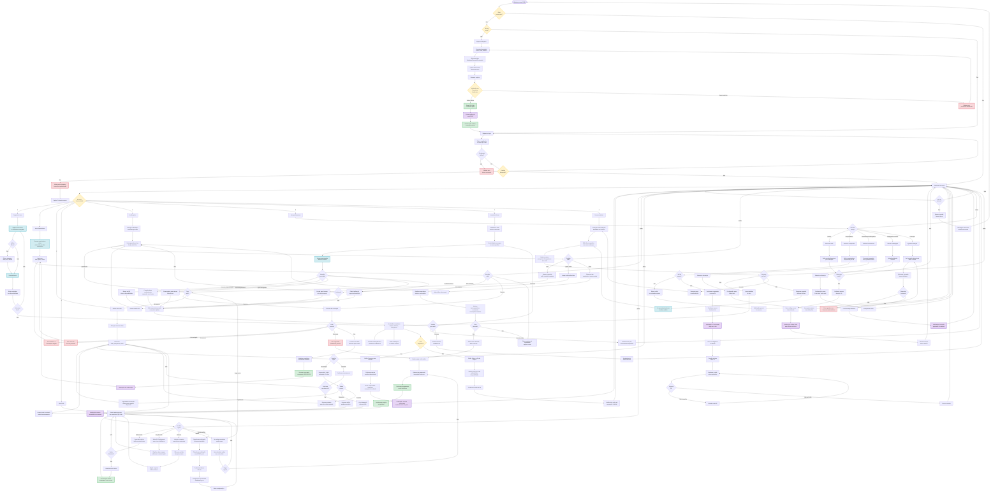

```mermaid
graph TD
    Start([Utilizador acessa SGBU]) --> CheckAuth{Está<br/>autenticado?}

    CheckAuth -->|Não| LoginChoice{Já tem<br/>conta?}
    CheckAuth -->|Sim| Dashboard[Dashboard Principal]

    LoginChoice -->|Não| Register[Página de Registro]
    LoginChoice -->|Sim| Login[Página de Login]

    %% Fluxo de Registro
    Register --> FillForm[Preencher formulário<br/>nome, email, telefone]
    FillForm --> SelectType[Selecionar tipo:<br/>Estudante/Docente/Funcionário]
    SelectType --> UploadDocs[Upload documentos<br/>cartão/matrícula]
    UploadDocs --> SubmitReg[Submeter registro]
    SubmitReg --> ValidateAPI{Validação com<br/>Secretaria<br/>Académica}
    ValidateAPI -->|Dados válidos| GenQR[Gerar QR Code<br/>credencial digital]
    ValidateAPI -->|Dados inválidos| RegError[Mostrar erro<br/>pendência identificada]
    RegError --> FillForm
    GenQR --> SendNotif1[Enviar notificação<br/>email/SMS]
    SendNotif1 --> RegSuccess[Confirmação cadastro<br/>instruções de uso]
    RegSuccess --> Login

    %% Fluxo de Login
    Login --> EnterCreds[Digitar email/senha<br/>ou scan QR Code]
    EnterCreds --> AuthCheck{Credenciais<br/>válidas?}
    AuthCheck -->|Não| LoginError[Mostrar erro<br/>tentar novamente]
    LoginError --> Login
    AuthCheck -->|Sim| CheckBlock{Usuário<br/>bloqueado?}
    CheckBlock -->|Sim| BlockMsg[Exibir motivo bloqueio<br/>instruções regularização]
    BlockMsg --> ContactSupport[Opção: Contactar suporte]
    CheckBlock -->|Não| Dashboard

    %% Dashboard Principal
    Dashboard --> DashMenu{Escolher<br/>funcionalidade}

    %% Opções do Dashboard
    DashMenu -->|1| SearchBooks[Pesquisar Livros]
    DashMenu -->|2| MyLoans[Meus Empréstimos]
    DashMenu -->|3| MyReservations[Minhas Reservas]
    DashMenu -->|4| Profile[Meu Perfil]
    DashMenu -->|5| Notifications[Notificações]
    DashMenu -->|6| Services[Serviços Especiais]
    DashMenu -->|7| Chatbot[Assistente Virtual]
    DashMenu -->|8| Recommendations[Recomendações]

    %% ========== FLUXO: PESQUISAR LIVROS ==========
    SearchBooks --> SearchInput[Digitar termo busca<br/>ou usar filtros avançados]
    SearchInput --> FilterOpt{Aplicar<br/>filtros?}
    FilterOpt -->|Sim| SetFilters[Filtros: categoria,<br/>autor, ano, idioma]
    FilterOpt -->|Não| ExecSearch[Executar busca]
    SetFilters --> ExecSearch
    ExecSearch --> ShowResults[Exibir resultados<br/>com disponibilidade]
    ShowResults --> SelectBook{Selecionar<br/>livro?}
    SelectBook -->|Não| SearchInput
    SelectBook -->|Sim| BookDetails[Ver detalhes completos<br/>sinopse, autores, exemplares]
    BookDetails --> ShowLocation[Mostrar localização física<br/>prateleira na biblioteca]
    BookDetails --> ShowReviews[Exibir avaliações<br/>de outros usuários]
    BookDetails --> CheckAvail{Livro<br/>disponível?}

    CheckAvail -->|Sim| ReserveOnline[Botão: Reservar para retirada]
    CheckAvail -->|Não| AddToQueue[Botão: Entrar na fila de espera]

    ReserveOnline --> ConfirmReserve[Confirmar reserva<br/>escolher data retirada]
    ConfirmReserve --> GenVoucher[Gerar comprovante eletrônico<br/>com prazo de retirada]
    GenVoucher --> NotifyReserve[Notificação: reserva confirmada<br/>lembrete antes do prazo]
    NotifyReserve --> Dashboard

    AddToQueue --> ShowPosition[Mostrar posição na fila<br/>estimativa de disponibilidade]
    ShowPosition --> ConfirmQueue[Confirmar entrada na fila]
    ConfirmQueue --> QueueNotify[Notificação: você está<br/>na posição X da fila]
    QueueNotify --> Dashboard

    %% ========== FLUXO: MEUS EMPRÉSTIMOS ==========
    MyLoans --> LoadLoans[Carregar empréstimos ativos<br/>ordenados por data vencimento]
    LoadLoans --> ShowLoansList[Lista com:<br/>título, prazo, status]
    ShowLoansList --> LoanAction{Escolher<br/>ação}

    LoanAction -->|Ver detalhes| LoanDetail[Detalhes empréstimo<br/>histórico renovações]
    LoanAction -->|Renovar| RenewFlow[Processo de renovação]
    LoanAction -->|Voltar| Dashboard

    LoanDetail --> ShowLoanInfo[Mostrar:<br/>data empréstimo, vencimento<br/>renovações restantes]
    ShowLoanInfo --> CheckOverdue{Está<br/>atrasado?}
    CheckOverdue -->|Sim| ShowFine[Exibir multa calculada<br/>dias de atraso]
    CheckOverdue -->|Não| ShowDaysLeft[Dias restantes até vencimento<br/>opção renovar]
    ShowFine --> PayFineOpt[Opção: pagar multa online]
    ShowDaysLeft --> LoanAction
    PayFineOpt --> PaymentGateway

    RenewFlow --> ValidateRenewal{Pode<br/>renovar?}
    ValidateRenewal -->|Limite atingido| RenewError1[Erro: limite de 2<br/>renovações atingido]
    ValidateRenewal -->|Há reserva| RenewError2[Erro: livro tem<br/>reserva pendente]
    ValidateRenewal -->|Tem multa| RenewError3[Erro: regularize<br/>pendências primeiro]
    ValidateRenewal -->|Sim| CalcNewDate[Calcular nova data<br/>conforme tipo usuário]

    RenewError1 --> ShowLoansList
    RenewError2 --> ShowLoansList
    RenewError3 --> PayFineOpt

    CalcNewDate --> UpdateLoan[Atualizar empréstimo<br/>incrementar contador]
    UpdateLoan --> RenewSuccess[Sucesso: nova data<br/>vencimento XX/XX/XXXX]
    RenewSuccess --> NotifyRenewal[Notificação de confirmação]
    NotifyRenewal --> ShowLoansList

    %% ========== FLUXO: MINHAS RESERVAS ==========
    MyReservations --> LoadReserves[Carregar reservas ativas]
    LoadReserves --> ShowResList[Lista com:<br/>título, posição fila, status]
    ShowResList --> ResAction{Escolher<br/>ação}

    ResAction -->|Ver posição| ShowQueuePos[Sua posição: X de Y<br/>estimativa: XX dias]
    ResAction -->|Cancelar| CancelRes[Confirmar cancelamento]
    ResAction -->|Voltar| Dashboard

    ShowQueuePos --> CheckResStatus{Status<br/>reserva}
    CheckResStatus -->|Aguardando| WaitMsg[Aguardando devolução<br/>notificaremos quando disponível]
    CheckResStatus -->|Disponível| AvailMsg[Livro disponível!<br/>retire em 48h]
    CheckResStatus -->|Expirado| ExpMsg[Reserva expirada<br/>prazo de coleta esgotado]

    WaitMsg --> ShowResList
    AvailMsg --> ShowPickupLoc[Mostrar local de retirada<br/>horário funcionamento]
    ShowPickupLoc --> ShowResList
    ExpMsg --> ShowResList

    CancelRes --> ConfirmCancel{Confirmar<br/>cancelamento?}
    ConfirmCancel -->|Não| ShowResList
    ConfirmCancel -->|Sim| RemoveQueue[Remover da fila<br/>atualizar posições]
    RemoveQueue --> CancelNotif[Notificação: reserva<br/>cancelada com sucesso]
    CancelNotif --> ShowResList

    %% ========== FLUXO: MEU PERFIL ==========
    Profile --> ShowProfile[Exibir dados pessoais<br/>tipo, matrícula, QR Code]
    ShowProfile --> ProfileMenu{Escolher<br/>opção}

    ProfileMenu -->|Editar dados| EditProfile[Formulário edição<br/>telefone, preferências]
    ProfileMenu -->|Ver QR Code| ShowQR[Exibir QR Code grande<br/>para scan na biblioteca]
    ProfileMenu -->|Histórico| ShowHistory[Histórico completo<br/>empréstimos passados]
    ProfileMenu -->|Multas| ShowFines[Ver multas pendentes<br/>opção pagar]
    ProfileMenu -->|Configurações| Settings[Preferências notificação<br/>idioma, privacidade]
    ProfileMenu -->|Voltar| Dashboard

    EditProfile --> SaveProfile{Salvar<br/>alterações?}
    SaveProfile -->|Sim| UpdateDB[Atualizar banco dados]
    SaveProfile -->|Não| ShowProfile
    UpdateDB --> ProfileSuccess[Confirmação: dados<br/>atualizados com sucesso]
    ProfileSuccess --> ShowProfile

    ShowQR --> QROptions[Opções: salvar imagem<br/>adicionar à carteira digital]
    QROptions --> ShowProfile

    ShowHistory --> FilterHistory[Filtrar por período<br/>categoria, status]
    FilterHistory --> ExportHistory[Opção: exportar<br/>PDF ou Excel]
    ExportHistory --> ShowProfile

    ShowFines --> FinesList[Lista detalhada multas<br/>tipo, valor, data]
    FinesList --> PayChoice{Pagar<br/>agora?}
    PayChoice -->|Sim| PaymentGateway[Gateway de pagamento<br/>integração financeira]
    PayChoice -->|Não| ShowProfile
    PaymentGateway --> PayConfirm[Confirmação pagamento<br/>recibo eletrônico]
    PayConfirm --> UnblockUser[Desbloquear usuário<br/>se aplicável]
    UnblockUser --> ShowProfile

    Settings --> NotifPrefs[Preferências notificação<br/>email, SMS, push]
    NotifPrefs --> LangPrefs[Preferência idioma<br/>PT, EN]
    LangPrefs --> PrivacyPrefs[Configurações privacidade<br/>visibilidade perfil]
    PrivacyPrefs --> SaveSettings[Salvar configurações]
    SaveSettings --> ShowProfile

    %% ========== FLUXO: NOTIFICAÇÕES ==========
    Notifications --> LoadNotifs[Carregar notificações<br/>ordenadas por data]
    LoadNotifs --> ShowNotifsList[Lista agrupada por tipo<br/>badge não lidas]
    ShowNotifsList --> NotifAction{Escolher<br/>ação}

    NotifAction -->|Abrir| ReadNotif[Marcar como lida<br/>exibir conteúdo completo]
    NotifAction -->|Limpar todas| ClearAll[Limpar notificações lidas]
    NotifAction -->|Filtrar| FilterNotifs[Filtrar por tipo:<br/>empréstimo, reserva, multa]
    NotifAction -->|Voltar| Dashboard

    ReadNotif --> NotifCTA{Tem<br/>ação?}
    NotifCTA -->|Renovar| RenewFlow
    NotifCTA -->|Ver reserva| MyReservations
    NotifCTA -->|Pagar multa| ShowFines
    NotifCTA -->|Apenas info| ShowNotifsList

    ClearAll --> ConfirmClear{Confirmar?}
    ConfirmClear -->|Sim| DeleteRead[Deletar lidas do BD]
    ConfirmClear -->|Não| ShowNotifsList
    DeleteRead --> ShowNotifsList

    FilterNotifs --> ApplyFilter[Aplicar filtro selecionado]
    ApplyFilter --> ShowNotifsList

    %% ========== FLUXO: SERVIÇOS ESPECIAIS ==========
    Services --> ServiceMenu{Escolher<br/>serviço}

    ServiceMenu -->|Cacifos| LockerService[Reservar cacifo]
    ServiceMenu -->|Computadores| ComputerService[Reservar computador]
    ServiceMenu -->|Levantamento bibliográfico| BibService[Solicitar levantamento]
    ServiceMenu -->|Catalogação na fonte| CatalogService[Solicitar catalogação]
    ServiceMenu -->|Formação| TrainingService[Agendar formação]
    ServiceMenu -->|Voltar| Dashboard

    %% Cacifos
    LockerService --> ShowLockers[Exibir cacifos disponíveis<br/>por localização]
    ShowLockers --> SelectLocker{Selecionar<br/>cacifo?}
    SelectLocker -->|Sim| ConfirmLocker[Confirmar reserva<br/>duração: 3h]
    SelectLocker -->|Não| Dashboard
    ConfirmLocker --> GenLockerCode[Gerar código acesso<br/>timer iniciado]
    GenLockerCode --> LockerNotif[Notificação: código XXXX<br/>aviso 30min antes fim]
    LockerNotif --> LockerActive[Monitorar tempo<br/>avisar atrasos]
    LockerActive --> Dashboard

    %% Computadores
    ComputerService --> ShowComputers[Exibir computadores<br/>disponíveis por lab]
    ShowComputers --> CheckQueue2{Há fila<br/>espera?}
    CheckQueue2 -->|Sim| JoinCompQueue[Entrar na fila<br/>ver estimativa espera]
    CheckQueue2 -->|Não| SelectComputer[Selecionar computador<br/>reservar 2h]
    JoinCompQueue --> CompQueueNotif[Notificação quando<br/>for sua vez]
    CompQueueNotif --> Dashboard
    SelectComputer --> ConfirmComp[Confirmar reserva<br/>horário início]
    ConfirmComp --> CompNotif[Notificação: PC reservado<br/>dirija-se ao lab]
    CompNotif --> CheckinComp[Check-in obrigatório<br/>no balcão]
    CheckinComp --> StartSession[Sessão iniciada<br/>timer 2h]
    StartSession --> SessionActive[Monitorar sessão<br/>avisos periódicos]
    SessionActive --> RenewComp{Renovar<br/>2h?}
    RenewComp -->|Sim e sem fila| ExtendSession[Estender mais 2h]
    RenewComp -->|Não ou há fila| EndSession[Encerrar sessão]
    ExtendSession --> SessionActive
    EndSession --> Dashboard

    %% Levantamento bibliográfico
    BibService --> BibForm[Preencher formulário<br/>tema, palavras-chave]
    BibForm --> SubmitBib[Submeter solicitação]
    SubmitBib --> BibConfirm[Confirmação: prazo<br/>5 dias úteis]
    BibConfirm --> TrackBib[Acompanhar status<br/>via notificações]
    TrackBib --> Dashboard

    %% Catalogação na fonte
    CatalogService --> UploadBook[Upload foto/dados<br/>da obra]
    UploadBook --> SubmitCatalog[Submeter solicitação]
    SubmitCatalog --> CatalogConfirm[Confirmação: prazo<br/>5 dias úteis, sem custo]
    CatalogConfirm --> TrackCatalog[Acompanhar status]
    TrackCatalog --> Dashboard

    %% Formação
    TrainingService --> ShowTrainings[Ver formações disponíveis<br/>datas e temas]
    ShowTrainings --> SelectTraining[Selecionar formação<br/>bases de dados]
    SelectTraining --> CheckDate{Disponível<br/>1 semana?}
    CheckDate -->|Não| DateError[Erro: agendar com<br/>1 semana antecedência]
    CheckDate -->|Sim| ConfirmTraining[Confirmar agendamento]
    DateError --> ShowTrainings
    ConfirmTraining --> TrainingNotif[Notificação: formação<br/>agendada + lembretes]
    TrainingNotif --> Dashboard

    %% ========== FLUXO: CHATBOT ==========
    Chatbot --> ChatInterface[Interface de chat<br/>histórico conversas]
    ChatInterface --> UserMessage[Usuário digita mensagem<br/>ou usa sugestões]
    UserMessage --> ProcessNLP[IA processa intenção<br/>detecta contexto]
    ProcessNLP --> IntentCheck{Intenção<br/>detectada?}

    IntentCheck -->|Consulta disponibilidade| QueryBot[Buscar no BD<br/>retornar disponibilidade]
    IntentCheck -->|Dúvida regulamento| KnowledgeBot[Consultar base conhecimento<br/>responder com fontes]
    IntentCheck -->|Ajuda navegação| GuideBot[Guiar usuário pelo sistema<br/>links diretos]
    IntentCheck -->|Problema técnico| EscalateBot[Escalar para humano<br/>criar ticket suporte]
    IntentCheck -->|Não entendeu| ClarifyBot[Pedir clarificação<br/>sugerir reformulação]

    QueryBot --> BotResponse[Exibir resposta formatada<br/>com ações rápidas]
    KnowledgeBot --> BotResponse
    GuideBot --> BotResponse
    EscalateBot --> BotResponse
    ClarifyBot --> BotResponse

    BotResponse --> ChatAction{Usuário<br/>quer mais?}
    ChatAction -->|Continuar| UserMessage
    ChatAction -->|Executar ação| ActionRedirect[Redirecionar para<br/>funcionalidade específica]
    ChatAction -->|Encerrar| EndChat[Avaliar conversa<br/>feedback bot]

    ActionRedirect --> Dashboard
    EndChat --> ThankBot[Agradecimento<br/>salvar histórico]
    ThankBot --> Dashboard

    %% ========== FLUXO: RECOMENDAÇÕES ==========
    Recommendations --> LoadRecs[Carregar recomendações<br/>baseadas em histórico]
    LoadRecs --> ShowRecs[Exibir livros sugeridos<br/>com score confiança]
    ShowRecs --> RecExplain["Explicar motivo:<br/>'porque leu X', 'popular no seu curso'"]
    RecExplain --> RecAction{Interesse<br/>em livro?}

    RecAction -->|Sim| GoToBook[Ir para detalhes<br/>do livro]
    RecAction -->|Não| DismissRec[Dispensar sugestão<br/>melhorar futuras]
    RecAction -->|Ver mais| RefreshRecs[Carregar novas<br/>recomendações]
    RecAction -->|Voltar| Dashboard

    GoToBook --> BookDetails
    DismissRec --> LearnPref[IA aprende preferências<br/>atualiza modelo]
    LearnPref --> ShowRecs
    RefreshRecs --> LoadRecs

    %% ========== FLUXO: LOGOUT ==========
    Dashboard --> LogoutOpt{Sair do<br/>sistema?}
    LogoutOpt -->|Sim| Logout[Encerrar sessão<br/>limpar tokens]
    LogoutOpt -->|Não| Dashboard
    Logout --> LogoutConfirm[Mensagem: até breve!<br/>estatísticas sessão]
    LogoutConfirm --> Start

    %% Estilos
    classDef successStyle fill:#d4edda,stroke:#28a745,stroke-width:2px
    classDef errorStyle fill:#f8d7da,stroke:#dc3545,stroke-width:2px
    classDef processStyle fill:#d1ecf1,stroke:#17a2b8,stroke-width:2px
    classDef decisionStyle fill:#fff3cd,stroke:#ffc107,stroke-width:2px
    classDef notifyStyle fill:#e7d4f5,stroke:#6f42c1,stroke-width:2px

    class RegSuccess,GenQR,RenewSuccess,ProfileSuccess,PayConfirm,UnblockUser successStyle
    class LoginError,RegError,BlockMsg,RenewError1,RenewError2,RenewError3,DateError errorStyle
    class SearchInput,ExecSearch,LoadLoans,ProcessNLP,LearnPref processStyle
    class CheckAuth,LoginChoice,ValidateAPI,CheckBlock,DashMenu,CheckAvail decisionStyle
    class SendNotif1,NotifyReserve,NotifyRenewal,CancelNotif,LockerNotif,CompNotif,TrainingNotif notifyStyle
```
