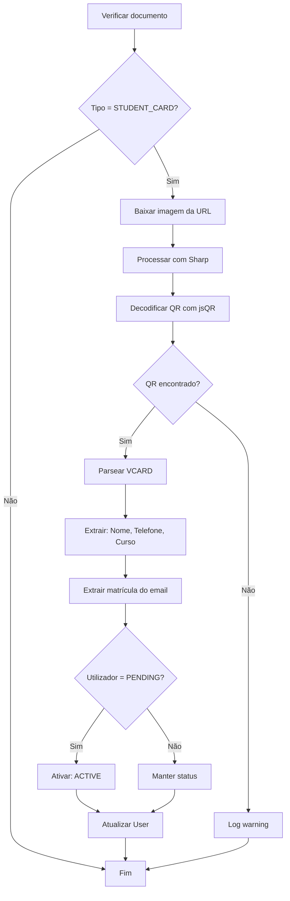

# SGBU-008 - Extensão: Extração Automática de Dados do QR Code

## 📋 Visão Geral

Esta funcionalidade estende o **SGBU-008** com extração inteligente de dados de estudantes a partir do QR Code presente no cartão de estudante do ISPTEC.

## 🎯 Objetivo

Quando um bibliotecário verifica o **Cartão de Estudante** de um aluno, o sistema:

1. ✅ Lê automaticamente o QR Code da imagem
2. ✅ Extrai dados no formato VCARD
3. ✅ Preenche automaticamente o perfil do estudante
4. ✅ Ativa o utilizador (se estava PENDING)

## 🔧 Tecnologias Utilizadas

### Bibliotecas

- **jsQR** `^1.4.0` - Decodificação de QR Code de imagens
- **sharp** `^0.33.5` - Processamento de imagens de alta performance
- **vcard-parser** (parsing manual implementado)

### Stack

- TypeScript 5+ com tipagem estrita
- Next.js 15+ (App Router)
- Prisma ORM

## 📁 Arquivos Criados/Modificados

### Novos Arquivos

#### `src/lib/qr-reader.ts`

Biblioteca utilitária para leitura e parsing de QR Codes:

**Funções Exportadas:**

```typescript
// Lê QR Code de imagem (Buffer ou URL)
readQRFromImage(imageInput: Buffer | string): Promise<string | null>

// Parseia string VCARD
parseVCard(vcardString: string): VCardData

// Extrai código de matrícula de email ISPTEC
extractRegistrationCode(email: string): string | null

// Pipeline completo: lê QR + parseia VCARD
extractStudentDataFromCard(imageInput: Buffer | string): Promise<VCardData | null>
```

**Interface VCardData:**

```typescript
interface VCardData {
  fullName?: string;
  firstName?: string;
  lastName?: string;
  phone?: string;
  email?: string;
  organization?: string;
  title?: string;
}
```

### Arquivos Modificados

#### `src/app/api/members/documents/[id]/route.ts`

- Importa funções de extração
- Adiciona lógica no `PATCH` para processar STUDENT_CARD
- Atualiza campos: name, phone, course, registrationNumber, status

#### `package.json`

- Adicionadas dependências: jsqr, sharp, vcard-parser

## 🔄 Fluxo de Extração

### 1. Upload do Cartão de Estudante

```
Estudante → Upload STUDENT_CARD → Cloudinary → UserDocument.documentUrl
```

### 2. Verificação pelo Bibliotecário

```
Bibliotecário → PATCH /api/members/documents/{id} → isVerified: true
```

### 3. Extração Automática (se STUDENT_CARD)



## 📝 Exemplo de VCARD

### Input (QR Code do Cartão)

```vcard
BEGIN:VCARD
VERSION:3.0
FN:Emanuel Carneiro dos Santos
N:Santos;Emanuel;Carneiro;;
TEL:+244 923 456 789
EMAIL:20241234@isptec.co.ao
ORG:Engenharia Informática
TITLE:Estudante
END:VCARD
```

### Output (Dados Extraídos)

```json
{
  "fullName": "Emanuel Carneiro dos Santos",
  "firstName": "Emanuel",
  "lastName": "Santos",
  "phone": "+244 923 456 789",
  "email": "20241234@isptec.co.ao",
  "organization": "Engenharia Informática"
}
```

### Atualização no User Model

```typescript
{
  name: "Emanuel Carneiro dos Santos",
  phone: "+244 923 456 789",
  course: "Engenharia Informática",
  registrationNumber: "20241234",
  status: UserStatus.ACTIVE // se estava PENDING
}
```

## 🧪 Testes

### Teste Manual

1. Criar utilizador com email `20241234@isptec.co.ao`
2. Upload de cartão de estudante com QR Code VCARD
3. Verificar documento como bibliotecário
4. Confirmar atualização automática:
   - Nome completo preenchido
   - Telefone adicionado
   - Curso registado
   - Código de matrícula extraído
   - Status = ACTIVE

### Casos de Erro (graceful degradation)

- ❌ **Sem QR Code na imagem** → Apenas verifica documento, não atualiza perfil
- ❌ **QR Code não é VCARD** → Log warning, operação continua
- ❌ **Erro ao baixar imagem** → Falha silenciosa, não bloqueia verificação
- ❌ **VCARD malformado** → Extrai campos válidos apenas

## 🔒 Segurança

### Validações

- ✅ Apenas staff autorizado pode verificar documentos
- ✅ Tipo de documento validado antes de processar QR
- ✅ Erros não bloqueiam a verificação principal
- ✅ Logs detalhados para debugging

### Privacidade

- ✅ Dados extraídos apenas do QR Code oficial do ISPTEC
- ✅ Não armazena dados brutos do QR Code
- ✅ Processamento server-side (não expõe bibliotecas ao cliente)

## 📊 Performance

### Otimizações

- **sharp**: Redimensiona imagem para max 1000px antes de processar
- **jsQR**: Processa apenas canal RGBA necessário
- **Async/Await**: Não bloqueia resposta HTTP principal

### Benchmarks Estimados

- Leitura de QR Code: ~200-500ms
- Parsing VCARD: <5ms
- Atualização DB: ~50ms
- **Total**: < 1 segundo

## 🚀 Deploy

### Variáveis de Ambiente

Nenhuma variável adicional necessária (usa as mesmas do upload).

### Dependências de Produção

```bash
npm install jsqr sharp vcard-parser --save
```

### Build

```bash
npm run build
```

Sharp tem binários nativos - Vercel/Railway fazem build automático.

## 📚 Referências

- [jsQR Documentation](https://github.com/cozmo/jsQR)
- [Sharp Documentation](https://sharp.pixelplumbing.com/)
- [VCARD 3.0 Specification](https://www.rfc-editor.org/rfc/rfc2426)
- [ISPTEC - Formato de Email](https://isptec.co.ao)

## 🎓 Contexto Académico

Esta funcionalidade demonstra integração de:

- ✅ Visão Computacional (QR Code reading)
- ✅ Parsing de dados estruturados (VCARD)
- ✅ Automação de processos (perfil auto-preenchido)
- ✅ Tratamento de erros gracioso

**Desenvolvedores:** Grupo 04 - ISPTEC  
**Data:** Janeiro 2026  
**Issue:** SGBU-008 (Extensão)
